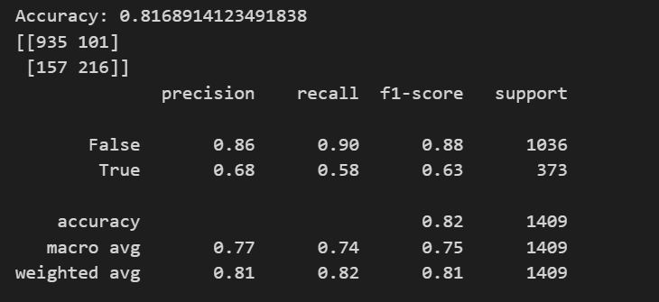

# Customer Churn Prediction

Customer churn is a critical issue in the telecommunications industry, impacting profitability and customer retention. This project uses machine learning to predict churn, enabling businesses to take proactive measures and improve customer satisfaction.

---

## Key Outcomes
- Achieved **81.7% accuracy** using Logistic Regression, with a weighted F1 score of **0.81**.
- Random Forest model was tested but achieved a slightly lower accuracy of **80%**.
- **Top predictor of churn:** *Month-to-Month contract type*, emphasizing the importance of subscription models in churn behavior.

---

## Project Highlights
- **Data Analysis:** Conducted in-depth analysis of customer demographics, service details, and account information to identify trends and correlations.
- **Machine Learning Models:** 
  - Logistic Regression achieved a balanced performance with high precision and recall.
  - Random Forest model tested as a benchmark for comparison.
- **Deployment:** Designed a user-friendly Flask application to allow users to upload datasets and get predictions in real-time.

---

## Visual Results
### Logistic Regression Performance:

### Key Insights:
- Customers with *Month-to-Month contracts* are at the highest risk of churn.
- Identified critical churn predictors, including tenure length and internet service type.

---

## Business Impact
This solution enables businesses to:
- **Proactively retain customers** by identifying at-risk groups early.
- **Personalize marketing strategies** based on churn predictors.
- **Enhance profitability** by reducing churn rates and increasing customer lifetime value.

---

## Tools and Technologies
- **Programming:** Python, Flask
- **Libraries:** Pandas, Scikit-learn, Matplotlib
- **Deployment:** Flask for real-time predictions
- **Dataset:** ## Dataset

The dataset used in this project is available for download:  
[Telco Customer Churn Dataset](https://github.com/Chadb12/chadb12.github.io/blob/main/data/Telco_Customer_Churn_Sample.csv)

---

## Call to Action
Interested in how I can bring similar insights to your organization?  
[Let’s connect on LinkedIn](https://www.linkedin.com/in/chad-broussard16) or explore the [GitHub repository](https://github.com/ChadB12/CustomerChurn).
